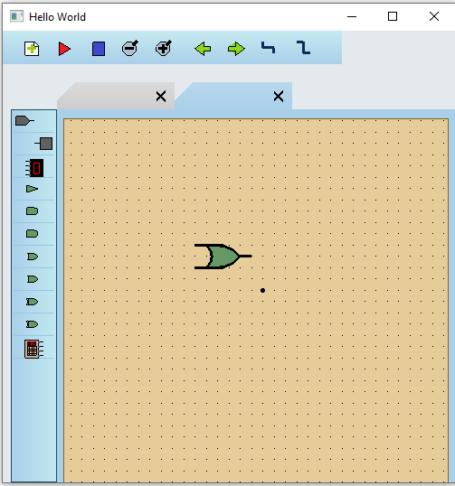
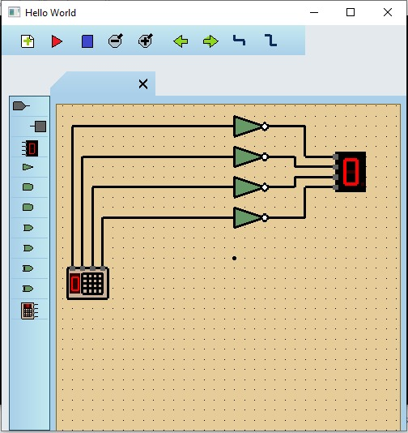

# Digital Eletronics Simulator
Implementação com OpenGL/GLUT de um Simulador de Eletrônica Digital, capaz de conectar entradas e portas lógicas a fim de verificar sua saída no circuito eletrônico. (2020)

## Controles:
- Digitar
- As
- Coisas

## Dependências
- [OpenGL/GLUT](http://www.univasf.edu.br/~jorge.cavalcanti/configcb.html)

## Screenshots

| | |
|------------------------|-------------------------|
